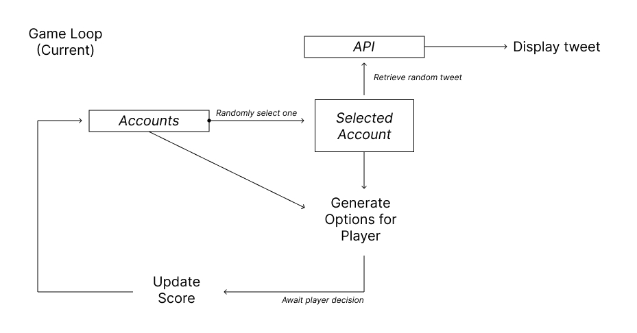
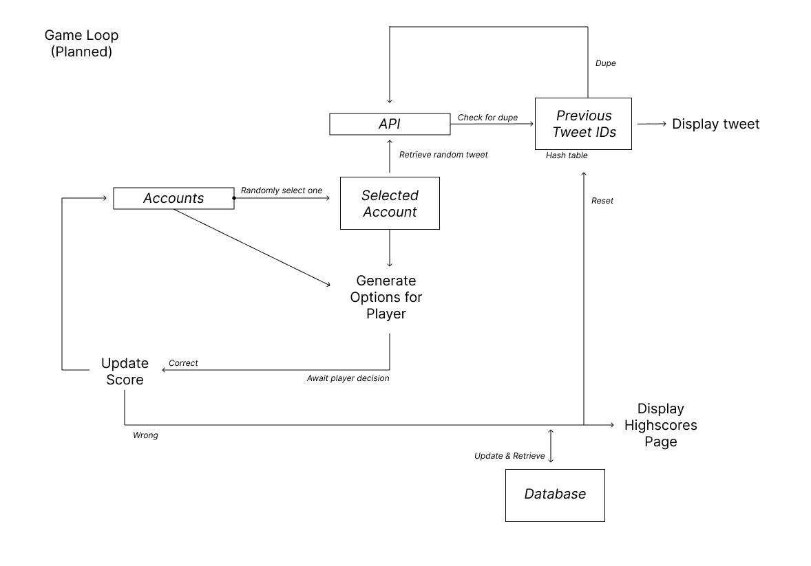

# Who Tweeted That?
Team Name: SigmaMindset | 5253

**Level of Achievement: Apollo 11**

## About
Who Tweeted That? is an interactive web-based game where players guess the author of tweets from their favourite celebrities.

Many of us follow our favourite celebrities and internet personalities on social media, where they share part of their lives, interests and opinions with their followers. But just how well do we know them? Can we recognize these celebrities when the handle is separated from the content?

Compete against your friends and other superfans in this web game - it’s time to find out who’s truly the biggest fan.

## Milestone 1
### Motivation
In our current digital age, the use of social media platforms like Twitter is steadily increasing. The idea of a game revolving around guessing the author of a tweet isn’t new, a quick google search reveals many examples - e.g. [website](https://edition.cnn.com/interactive/2016/02/politics/trump-kanye-who-tweeted/) and [video](https://www.youtube.com/watch?v=1nikltRn1m0). However, these implementations revolve around fixed, pre-selected tweets from specific individuals, which greatly diminishes replayability value. Hence, we wanted to create a similar concept where the game is programmatically generated, enabling greater user enjoyment and replayability.

The project seemed like a good fit for our goals, which were learning and gaining familiarity with modern web frameworks. This is because a game is a bit more involved than a static website, requiring more work on the frontend. Furthermore, we planned to incorporate a highscore system, which would allow us to gain experience in some backend development and linking the two together. It would also allow us to work with real-world data in the form of the Twitter API.

### User Stories
1. As a superfan who religiously follows my favourite internet personality, I want to be able to show everyone how well I know my idols.

2. As a person whose friend group follows similar creators, I want to compete against my friends and find out who knows the creators the best.

3. As a statistically minded person, I want to be able to see global user statistics in order to find the current trends.

### Core Features

|                                                                               Features                                                                               | Classification | Status |
|:--------------------------------------------------------------------------------------------------------------------------------------------------------------------:|:--------------:|:------:|
| Integration with twitter API - Fetching random tweet from username                                                                                                     |      Data / Backend      |  Done  |
| Randomly fetch a tweet from one of the specified accounts  |      Game Logic   (Basic)   |  Done  |
| Generate options for the player  |      Game  Logic  (Basic)  |  Done  |
|Correct behaviour on player choice (Add to score/Restart)  |      Game Logic (Basic)    |  Done  |
| Allow ability for user to choose twitter accounts                                                                                                                    |  Customization |   WIP  |
| Sanitization of tweets - Deal with images,  special characters	                                                                                                  |      Game      |   WIP  |
| Further integration with twitter API Support pagination to retrieve older tweets (currently only page 1, which is 10 most recent tweets)                             |      Data / Backend      |   WIP  |
| Full game logic Pagination of timeline to retrieve older tweets  Implement duplicate checking		                                                                        |      Game Logic (Full)     | Undone |
| Highscore page for tracking user statistics                                                                                                                          |       Data / Backend    | Undone |
| Preset groups of accounts based on interests (e.g. politics, MMA)                                                                                                    |  Customization | Undone |

### Design
#### Twitter API
The original plan was to just send requests to the Twitter API directly from the frontend. However, it turned out that the Twitter API [does not have support for CORS headers](https://twittercommunity.com/t/will-twitter-api-support-cors-headers-soon/28276), resulting in all requests made from the browser to be rejected.
This introduced the need for some form of a server, which will be responsible for retrieving the data from the Twitter API. The frontend will then retrieve the data from this server via a REST API.

After some learning, we settled on using [serverless functions](https://vercel.com/docs/concepts/functions/serverless-functions) hosted by Vercel. This seemed to be the best free option for deployment, as it is extremely fast and has 24/7 uptime, unlike other free alternatives like hosting an express server on a free Heroku dyno.

The API is deployed at https://orbital-api-eta.vercel.app/api, with sample calls as shown:

https://orbital-api-eta.vercel.app/api/userbyusername?username=barackobama

https://orbital-api-eta.vercel.app/api/usertimeline?id=813286&exclude=retweets%2Creplies

#### Game Logic
The current game loop is a simplified version used for a technical proof of concept. It takes in an array of accounts, and on each turn, it: 

1) Randomly selects the account from which the tweet will be chosen from
2) Queries the twitter API (through the process above) for a random tweet from that account
3) Displays the tweet for the player
4) Generates options for the player to choose, one of which will be the account in (1)
5) Increment the score if correct, else score will be set to 0
6) Repeat from (1)

*Figure 1: Current Game Loop*

The planned game loop involves storing previously chosen tweets in a hash table in order to prevent duplicates, as well as integration with a database to display and update highscores.
This will be worked on in future milestones.

*Figure 2: Planned Game Loop*

### Development Plan
- 1st week of June: Work on feature to allow users to select the twitter accounts, work on sanitizing posts e.g. exclude image only posts
- 2nd week of June: Work on pagination (API and integration), Pick up and learn backend technologies for highscore page and statistics (planned: Firebase/Supabase)
- 3rd week of June: Work on integration with backend
- 4th week of June: Testing, debugging, styling with either CSS or a library (planned: Material-UI/Chakra)
- 5th week of June: Finalize core features as outlined in the planned game loop above
- 1st week of July: Polish user interface, evaluate feasibility of certain optional features e.g. search feature, oAuth login, port to mobile etc
- 2nd/3rd week of July: Follow up on optional features

